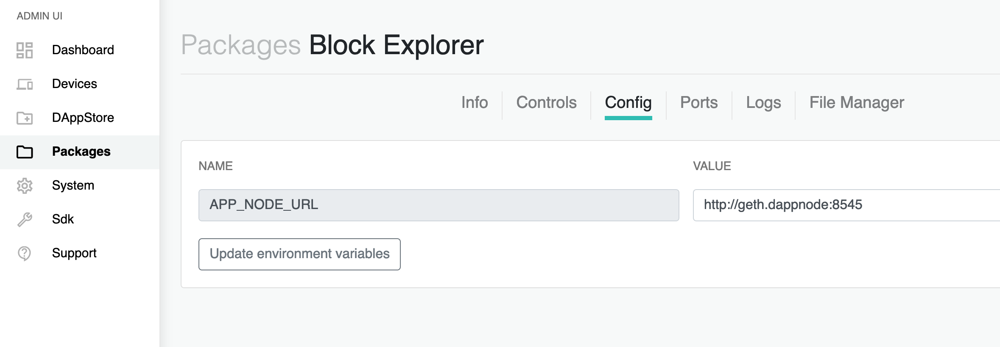
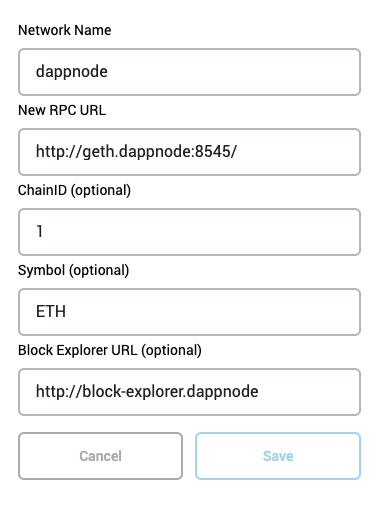

# Block Explorer DappNode Package

A block explorer for your dappnode's ethereum client. Uses [Alethio](https://github.com/Alethio/ethereum-lite-explorer) open-source block explorer.

## Usage
The dappnode block explorer uses local data to provide a ethereum block explorer that is fast, reliable, and private.

### Installation
1. Install the dnp via this installer url (must be on dappnode wifi): http://my.dappnode/#/installer/%2Fipfs%2FQmauPMK5fa87yek2k42aes3x6x5kGSkkcVSCXGxPFodaS7
2. Access your block explorer at http://block-explorer.dappnode

#### Integration with non-geth clients
By default, the block-explorer expects the eth1 http-rpc endpoint to be found at `http://geth.dappnode:8545/`

If you are not using geth as you eth client, you will need to update the package configuration with the correct url for your client.

### Metamask Integration
You can also set this dapp as the block explorer for your metamask!

Simply set the block explorer to `http://block-explorer.dappnode` in metamask network settings for your custom dappnode network.

## License
This project is licensed under the GNU General Public License v3.0 - see the [LICENSE](./LICENSE) file for details
